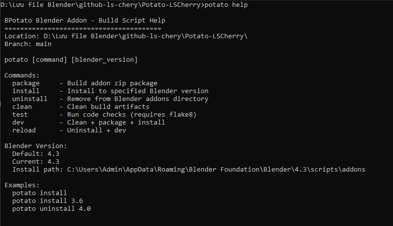
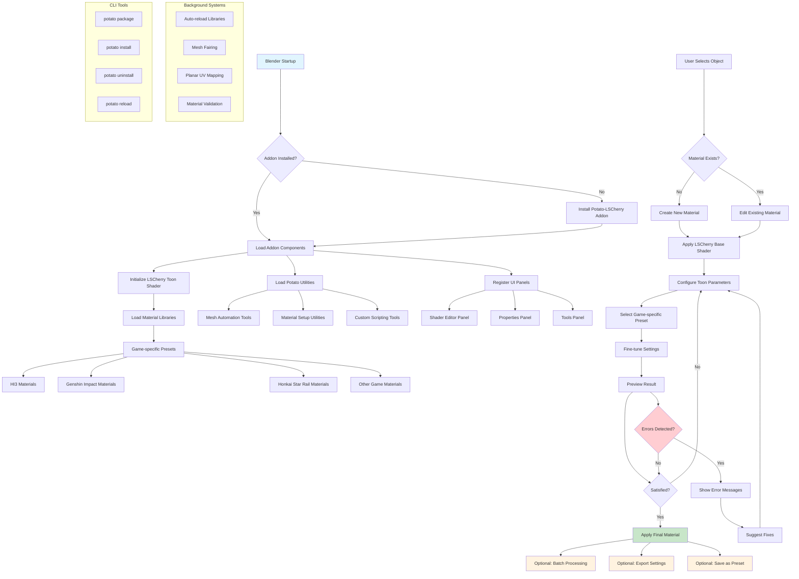

# 🥔 Potato-LSCherry

<p align="center">
  <a href="" rel="noopener">
 </a>
</p>

> A lightweight Blender add-on for potato-style automation 🍠 — simplify your workflow and focus on creativity.

<p align="center">
  <a href="#">
    
  </a>&nbsp;&nbsp;
  <a href="#">
    
  </a>&nbsp;&nbsp;
  <a href="https://www.blender.org/">
    
  </a>&nbsp;&nbsp;
  <a href="https://www.blender.org/">
    
  </a>&nbsp;&nbsp;
  <a href="https://opensource.org/license/mit">
    
  </a>&nbsp;&nbsp;
</p>

---

## 🚀 Prerequisites

Before getting started, ensure you have the following installed:

- 🖌️ **Blender** → `4.x` or above  
  👉 [Download](https://www.blender.org/download/releases/4-0/)  

- 🐍 **Python** → `3.x` or above (For developers)
  👉 [Download](https://www.python.org/downloads/)  

> [!TIP]  
> Using the latest stable version is recommended for the best compatibility.

---

## 😨 I dont want to read potato code

**Copy one of those to the terminal**

1. Build the addon, then checking \dist folder

```bash
potato package
```

2. Build and install/uninstall the addon based on your Blender version, default 4.3

```bash
potato install 4.x
```

```bash
potato uninstall 4.x
```

3. If you're a dev, "reload" is a combination of UnInstall + Clean + package + Install

```bash
potato reload
```

---

## 🚀 Features

- 🔄 **Automated mesh adjustments**
- 🎨 **Quick material setup**
- 🧩 **Custom utilities for Blender scripting**
- ⚡ **One-click run from Blender or terminal**
- 🛠 **Extensible Python codebase**

---

## 📦 Installation

### 1️⃣ Install as Blender Add-on

1. Download the latest release ZIP from [Releases](https://github.com/lvoxx/Potato-Blender/releases).
2. Open Blender → `Edit` → `Preferences` → `Add-ons` → `Install...`
3. Select the ZIP file → enable **Potato-Blender**.

### 2️⃣ Install via Source (Dev Mode)

```bash
git clone https://github.com/lvoxx/Potato-Blender.git
cd Potato-Blender
```

---

# Developer Section

## Quick Help

```bash
potato help
```



## Project Architecture


