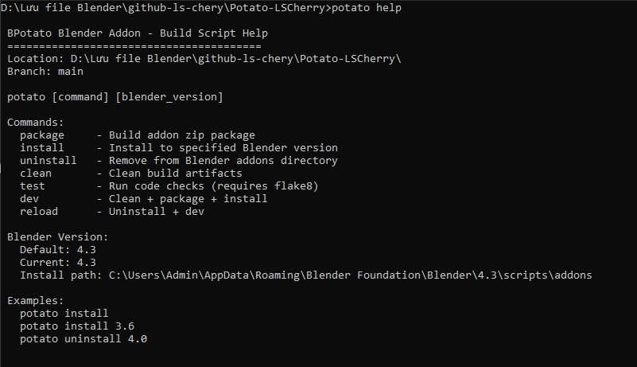
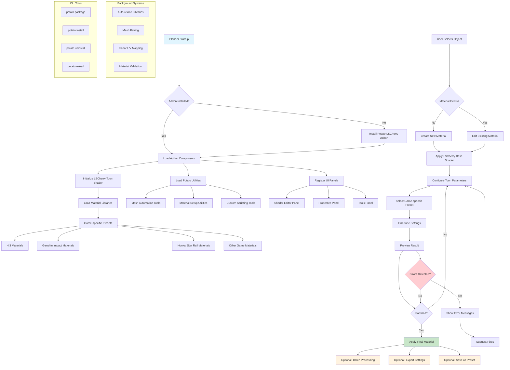

# 🥔 Potato-LSCherry

<p align="center">
  <a href="" rel="noopener">
 </a>
</p>

> A lightweight Blender add-on for potato-style automation 🍠 — simplify your workflow and focus on creativity.

<p align="center">
  <a href="#">
    
  </a>&nbsp;&nbsp;
  <a href="#">
    
  </a>&nbsp;&nbsp;
  <a href="https://www.blender.org/">
    
  </a>&nbsp;&nbsp;
  <a href="https://www.blender.org/">
    
  </a>&nbsp;&nbsp;
  <a href="https://opensource.org/license/mit">
    
  </a>&nbsp;&nbsp;
</p>

---

## 🚀 Prerequisites

Before getting started, ensure you have the following installed:

- 🖌️ **Blender** → `5+` or above 👉 [Download](https://www.blender.org/download/releases/4-0/)

- 🐍 **Python** → `3.x` or above (For developers) 👉 [Download](https://www.python.org/downloads/)

> [!TIP]  
> Using the latest stable version is recommended for the best compatibility.

---

## 📦 Installation

### 1️⃣ Install as Blender Add-on

1. Download the latest release ZIP from [Releases](https://github.com/lvoxx/Potato-Blender/releases).
2. Open Blender → `Edit` → `Preferences` → `Add-ons` → `Install...`
3. Select the ZIP file → enable **Potato-Blender**.

### 2️⃣ Install via Source (Dev Mode)

```bash
git clone https://github.com/lvoxx/Potato-Blender.git
cd Potato-Blender
```

---

## 😨 I dont want to read potato code - For Dev

**Copy one of those to the terminal**

1. Build the addon, then checking \dist folder

```bash
potato package
```

2. Build and install/uninstall the addon based on your Blender version, default 4.3

```bash
potato install 4.x
```

```bash
potato uninstall 4.x
```

3. If you're a dev, "reload" is a combination of UnInstall + Clean + package + Install

```bash
potato reload
```

---

## 🚀 Features

- 🔄 **Automated registry download**
- 🎨 **Quick material setup**
- 🧩 **Custom utilities for Blender scripting**
- ⚡ **One-click run from Blender or terminal**
- 🛠 **Extensible Python codebase**

---

# **🔳 LSRegistry Downloader**

This feature is part of the **LSPotato addon**, used for downloading and managing **registry data** from the LSRegistry system.
It is **not a standalone project** — it is a **newly added feature** inside the addon.

Core capabilities:

- Download registry metadata (`registry.yaml`, `registry.ls.yaml`)
- Fetch GitHub releases
- Extract registry files into the project
- Automatically link objects from `.blend` files
- Maintain LSRegistry collections inside the Scene
- Provide Repair functionality
- Support GitHub token authentication for private repositories

---

## **Working Directory Structure (After Installation)**

```
YourProject/
├── YourBlendFile.blend
└── registry/
    ├── metadata/
    │   └── io.github.lvoxx.world-builder/
    │       ├── registry.yaml
    │       └── registry.ls.yaml
    └── io.github.lvoxx.world-builder_dummy/
        └── World-Builder.blend
```

---

## **Usage Example**

User enters in the UI:

```
io.github.lvoxx.world-builder:dummy
```

Flow:

1. User clicks **Get**
2. Metadata files are downloaded
3. The release ZIP is fetched
4. Files are extracted into the `registry/` directory
5. The addon links the `"Main"` object from `World-Builder.blend`
6. UI displays:

```
Installed: io.github.lvoxx.world-builder:dummy
```

---

## **Flow Diagram**


---

## **📋 GET Flow**

When the user clicks **Get**, the system:

1. **Downloads & extracts** the release → ✅
2. **Creates the root `LSRegistry` collection** (blue, COLOR_04) in the Scene → ✅
3. **Creates a sub-collection named:**
   `io-github-lvoxx-world-builder-dummy` → ✅
4. **Links objects** from extracted `.blend` files **into this sub-collection** → ✅

---

## **🔧 REPAIR Flow**

When the user clicks **Repair**, the system:

1. Locates the **`LSRegistry`** collection → ✅
2. Scans all **child collections** → ✅
3. Parses collection names, for example:
   `io-github-lvoxx-world-builder-dummy`
   → namespace + version → ✅
4. Finds corresponding registry folder:
   `registry/io.github.lvoxx.world-builder_dummy/` → ✅
5. Removes **only broken links** inside that specific collection → ✅
6. Re-downloads the release ZIP → ✅
7. Re-extracts and **re-links objects** → ✅

---

## **Resulting Object Structure**

```
Scene Collection
└── 📁 LSRegistry  (🔵 Blue – COLOR_04)
    └── 📁 io-github-lvoxx-world-builder-dummy
        └── 🔗 Main   (linked object)
```

---

## **Credentials Support**

For private GitHub repositories:

1. The user sets a GitHub Token in **Addon Preferences**
2. The token is used via the `Authorization` header during downloads
3. Multiple credential profiles are supported (extensible)

---

# NodeCompiler

> Feature integrated into LSPotato: compile node groups into hardcoded custom nodes (similar to the Parallax addon)

---

## 1. Architectural Analysis: Parallax Addon (Reference)

### 1.1 Core Operating Mechanism

The Parallax addon **does not save node groups into the `.blend` file**. Instead, it **builds the node group using Python code upon initialization**. This is the exact "compiled node" model that needs to be replicated.

```

ShaderNodeCustomGroup  ←  Blender Base class
↑
ShaderNode (nodes/utils.py)     ← Internal base: addSocket, addNode, innerLink, value_set
↑
ShaderNodeParallaxImage             ← Specific node class

```

**Node initialization workflow:**

```

User adds node → init() → getNodetree(name) → createNodetree(name)
├── bpy.data.node_groups.new(...)
├── nt.interface.new_socket(...)  ← define I/O
├── nt.nodes.new(...)             ← create child nodes
├── nt.links.new(...)             ← link connections
└── valuesUpdate()               ← sync custom props

```

**Custom property processing workflow (UV, Image):**

```

User changes uv_map/elevation_image
→ update callback → valuesUpdate(context)
→ iterate through nt.nodes, look for TEX_IMAGE / UVMap
→ assign node.image / node.uv_map

```

**Legacy / File load handling:**

```

bpy.app.handlers.load_post → convert_legacy_nodes()
→ scan materials, search for outdated nodes
→ create new node, copy inputs/outputs/links
→ delete old node

```

### 1.2 Problems Resolved by Parallax

| Problem             | Parallax Solution                                                                |
| ------------------- | -------------------------------------------------------------------------------- |
| Nested node groups  | `ShaderNodeGroup` references the child node group, which is also built via code  |
| Custom property UI  | `bpy.props.PointerProperty`, `StringProperty`, `EnumProperty` + `draw_buttons()` |
| Empty Image Texture | `valuesUpdate()` syncs after every property change                               |
| Empty UV Map        | `valuesUpdate()` + `draw_buttons()` using `prop_search()`                        |
| Duplicate node      | `self.node_tree = self.node_tree.copy()` when `users > 1`                        |
| Hidden node prefix  | `TEST_PREFIX = "."` → hides the node group from the Blender UI                   |
| Frame & Reroute     | Frames are ignored; Reroutes are still created to maintain wiring paths          |

---

## 2. Compiler Strategy

### 2.1 What to Compile vs. What to Skip

```

Original Node Group (editable)
├── KEEP  → interface sockets (inputs/outputs)
├── KEEP  → node group metadata (color_tag, description, type)
├── KEEP  → all functional nodes (Math, VectorMath, Mix, ...)
├── KEEP  → child nodes (ShaderNodeGroup → nested group)
├── KEEP  → all links between nodes
├── KEEP  → default_value of input sockets
├── KEEP  → custom attributes of the node (operation, data_type, ...)
├── KEEP  → TEX_IMAGE node (image=None, but register prop to sync)
├── KEEP  → UVMAP node (uv_map="", register prop to sync)
├── SKIP  → Frame node (NodeFrame) — does not affect logic
└── REROUTE → NodeReroute — MUST be kept to avoid breaking links!

```

**Important note on Reroutes:** A Reroute contains no logic but acts as an intermediate point for links. If deleted without redirecting the links, connections will break. They need to be **inlined**: trace back to the actual `from_socket` through the chain of reroutes.

### 2.2 Handling Nested Node Groups

With over 300 node groups containing child node groups, a **recursive compilation** is required:

```

compile(node_group):
for node in node_group.nodes:
if node.type == 'GROUP' and node.node_tree:
if node.node_tree is not compiled yet:
compile(node.node_tree)   ← recursion
write reference to the compiled version

```

Compilation order: **Bottom-up** (leaves first, root last) to ensure that when compiling a parent, the child already has its compiled code ready.

### 2.3 Handling TEX_IMAGE and UVMap

When a node group contains a `ShaderNodeTexImage` with image=None or a `ShaderNodeUVMap` with uv_map="":

```python
# Detect in compiler
if node.type == 'TEX_IMAGE':
    label = node.label or "Image Texture"   # preserve custom label if available
    description = ...                        # retrieve from the nearest Group Input if available
    # → add bpy.props.PointerProperty to the output class
    # → add valuesUpdate() to sync image

if node.type == 'UVMAP':
    # → add bpy.props.StringProperty
    # → add prop_search() to draw_buttons()
    # → sync uv_map inside valuesUpdate()

```

---

# Developer Section

## Quick Help

```bash
potato help
```



## Project Architecture


```mermaid
graph TD
    %% Main Entry Point
    A[Blender Startup] --> B{Addon Installed?}
    B -->|No| C[Install Potato-LSCherry Addon]
    B -->|Yes| D[Load Addon Components]
    C --> D

    %% Core Components Loading
    D --> E[Initialize LSCherry Toon Shader]
    D --> F[Load Potato Utilities]
    D --> G[Register UI Panels]

    %% LSCherry Toon Shader System
    E --> H[Load Material Libraries]
    H --> I[Game-specific Presets]
    I --> J[HI3 Materials]
    I --> K[Genshin Impact Materials]
    I --> L[Honkai Star Rail Materials]
    I --> M[Other Game Materials]

    %% Potato Automation System
    F --> N[Mesh Automation Tools]
    F --> O[Material Setup Utilities]
    F --> P[Custom Scripting Tools]

    %% User Interface
    G --> Q[Shader Editor Panel]
    G --> R[Properties Panel]
    G --> S[Tools Panel]

    %% Main Workflow
    T[User Selects Object] --> U{Material Exists?}
    U -->|No| V[Create New Material]
    U -->|Yes| W[Edit Existing Material]

    V --> X[Apply LSCherry Base Shader]
    W --> X
    X --> Y[Configure Toon Parameters]
    Y --> Z[Select Game-specific Preset]
    Z --> AA[Fine-tune Settings]
    AA --> BB[Preview Result]
    BB --> CC{Satisfied?}
    CC -->|No| Y
    CC -->|Yes| DD[Apply Final Material]

    %% Advanced Features
    DD --> EE[Optional: Batch Processing]
    DD --> FF[Optional: Export Settings]
    DD --> GG[Optional: Save as Preset]

    %% Error Handling
    BB --> HH{Errors Detected?}
    HH -->|Yes| II[Show Error Messages]
    HH -->|No| CC
    II --> JJ[Suggest Fixes]
    JJ --> Y

    %% Background Processes
    subgraph "Background Systems"
        KK[Auto-reload Libraries]
        LL[Mesh Fairing]
        MM[Planar UV Mapping]
        NN[Material Validation]
    end

    %% CLI Tools
    subgraph "CLI Tools"
        OO[potato package]
        PP[potato install]
        QQ[potato uninstall]
        RR[potato reload]
    end

    style A fill:#e1f5fe
    style DD fill:#c8e6c9
    style HH fill:#ffcdd2
    style EE fill:#fff3e0
    style FF fill:#fff3e0
    style GG fill:#fff3e0
```
